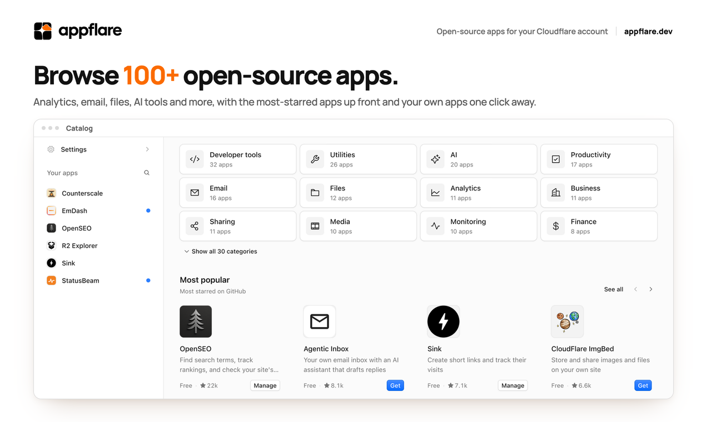

<h1 align="center">
  <picture>
    <source media="(prefers-color-scheme: dark)" srcset="docs/assets/logo_full_white.svg">
    
  </picture>
</h1>

<strong>100+ apps for your own Cloudflare account.</strong>

The official app catalog for [Appflare](https://github.com/appflare/appflare).
Find apps for analytics, email, files, AI, productivity and more, then install and
update them from your Appflare dashboard.

[Browse all apps](https://appflare.dev/apps/) · [Install Appflare](https://appflare.dev/start/install/) · [Submit an app](https://appflare.dev/catalog/submit/) · [Contributing](CONTRIBUTING.md)

## Find your next app

A few apps you can install through Appflare:

| App | What it does |
| --- | --- |
|  [OpenSEO](https://appflare.dev/apps/open-seo/) | Find search terms, track rankings and check your site's health. |
|  [Sink](https://appflare.dev/apps/sink/) | Create short links and track their visits. |
|  [Counterscale](https://appflare.dev/apps/counterscale/) | Track website visits with a dashboard you host yourself. |
|  [Agentic Inbox](https://appflare.dev/apps/agentic-inbox/) | Your own email inbox with an AI assistant that drafts replies. |
|  [NodeWarden](https://appflare.dev/apps/nodewarden/) | A password vault that syncs with your Bitwarden apps. |

[Explore the full catalog](https://appflare.dev/apps/) for app details,
screenshots, licenses and requirements.

## Install an app

1. [Install Appflare](https://appflare.dev/start/install/) in your Cloudflare account.
2. Open **Catalog** in Appflare and choose an app.
3. Review its requirements, fill in any settings it needs and select **Install**.

Appflare creates the resources the app needs. Afterwards you manage its updates,
custom domains and access control from the same dashboard. The app runs in your
account and keeps running without Appflare.

Appflare is free. Each app's page shows its requirements and whether it needs Workers
Paid. Apps count against your own Cloudflare plan, and some use third-party services
with their own pricing.

## Add or improve an app

You can submit an app, update an existing entry or improve its description and
images. Adding an app does not require changing the upstream project's repository.

1. Follow the [submission guide](https://appflare.dev/catalog/submit/) to create
   `apps/<slug>/appflare.jsonc`, or edit an existing entry.
2. Set up the [local tooling and checks](CONTRIBUTING.md#local-tooling).
3. Open a pull request with your changes.

The [contribution guide](CONTRIBUTING.md) covers app requirements, packaging,
images, version updates and review. To request an app or report a packaging
problem, [open an issue](https://github.com/appflare/catalog/issues).

## What's in this repository

| Path | Purpose |
| --- | --- |
| [`apps/`](apps) | Each app's manifest, images and packaging notes. |
| [`index.json`](index.json) | The published catalog Appflare reads. Generated by the workflows; do not edit it directly. |
| [`schema/`](schema) | The manifest schema. |
| [`scripts/`](scripts) | Tools for validating entries, building releases and maintaining the catalog. |

Each entry pins one upstream commit. GitHub workflows build the releases, update
`index.json` and run install checks on pull requests and every night. See
[how the catalog works](https://appflare.dev/catalog/how-it-works/) for the details.

## Run your own catalog

Use this repository as a template for a community collection or your own apps,
signed with your own key. Appflare admins can add it under **Settings > Catalogs**.
[TEMPLATE.md](TEMPLATE.md) covers publishing and connecting your catalog.

## License

Catalog tooling is [Apache-2.0](LICENSE). Each app keeps its upstream license, and
listing it here does not change that. Most apps are open source. A few are
source-available or have no license, and their app pages say so.

Appflare is an independent open-source project and is not affiliated with,
endorsed by or sponsored by Cloudflare, Inc.
